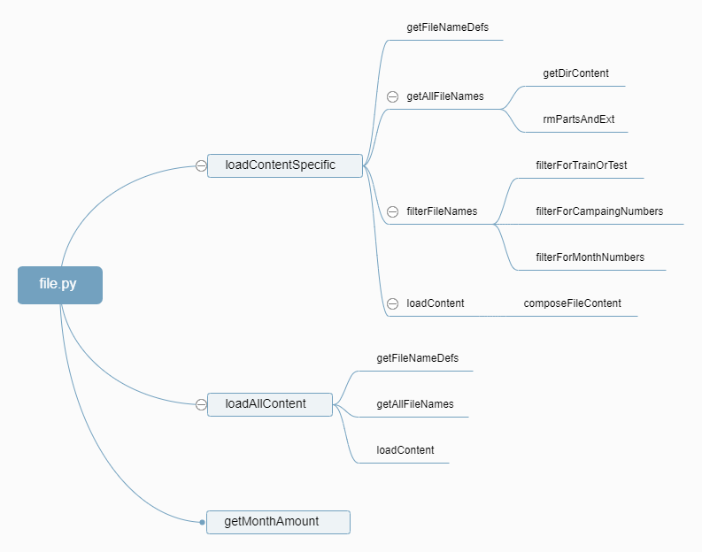
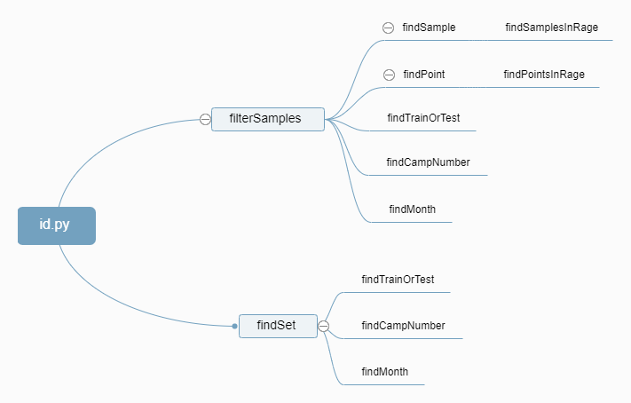
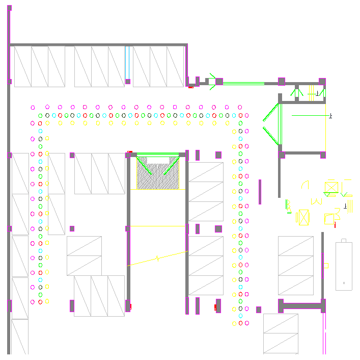
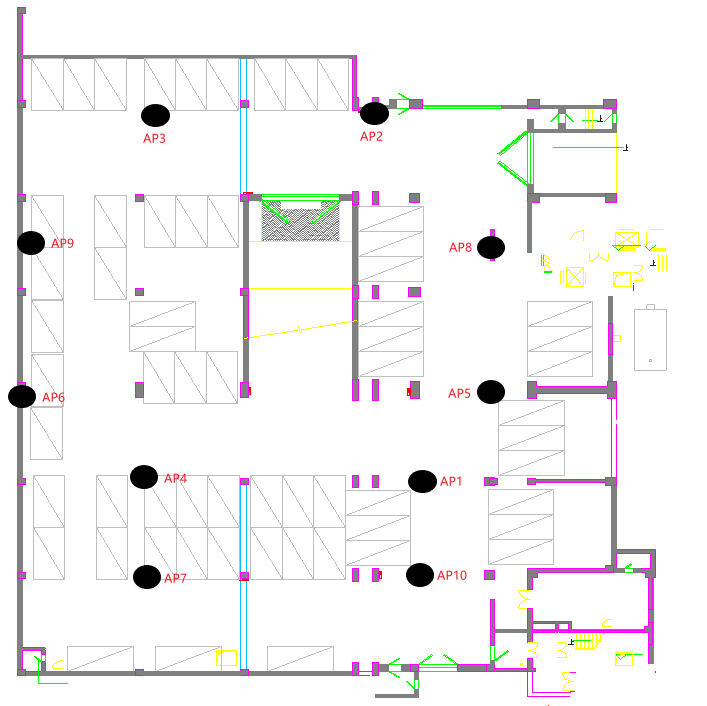

# Indoor Positioning by Python
用Python实现WiFi室内定位的相关算法，参考了文献[1]。如果有相关问题，请在github上提交issue，如果发现bug或实现了不同的WiFi室内定位算法，欢迎提交pull request。
## 步骤
#### 1. 采集数据
使用NetSpot软件在华北电力大学地下停车场采集数据。
#### 2. 数据处理
将采集的原始数据处理成易于观察和处理的数据格式
#### 3. 过滤数据
根据样本的ID获得所需的数据。
#### 4. 应用定位算法
测试不同WiFi室内定位算法的定位效果，目前实现了4种WiFi室内定位算法，Rand，KNN，Prob，Stg。
## 文档结构
* src: 代码
* db: 对original_data处理后得到的易于观察和处理的数据，目录下有更详细的说明
* original_data: 数据采集软件导出的原始数据，目录下有更详细的说明
* img: README.md中用到的图片
## 函数调用关系
#### 与文件相关的函数

#### 与样本ID相关的函数

## 定位算法
#### 随机方法
将测试点（Test Point, TP）的预测位置设为任一参考点（Reference Point，RP）的位置。
#### KNN方法[2]
KNN方法的主要思路是：找出与TP的WiFi指纹相似度最高的K个RP，然后平均这K个RP对应的位置，最终得到TP的位置。
#### Prob方法[3]
Prob方法的主要思路是：通过贝叶斯公式，计算TP出现在每个RP上的后验概率，取k个概率最大的RP，然后平均这K个RP对应的位置，最终得到TP的位置。
#### Stg方法[4]
Stg方法是KNN方法的一种改进方法，它通过TP的k个信号最强的信号接入点来筛选RP，然后再应用KNN方法。
#### Gk方法[5]
GK方法的主要思路是通过高斯核密度估计器（Gaussian Kernel Density Estimator，GKDE）计算每个指纹位置的相对过饱和度的可能性，并通过平均与最高似然值对应的位置来确定TP的位置。（尚未复现）
## 室内地图
#### 数据采集点的位置

#### AP的位置

## 参考文献
[1] Mendoza-Silva, Germán, Martín,等. Long-Term WiFi Fingerprinting Dataset for Research on Robust Indoor Positioning[J]. Data, 2018.

[2] P. Bahl, V. N. Padmanabhan, Radar: an in-building rf-based user location and tracking system, in: IN-FO-COM 2000. Nineteenth Joint Conference of the IEEE Computer and Communications Societies. Pro-ceedings. IEEE, 2000, pp. 775–784 vol.2.

[3] Youssef M , Agrawala A . The Horus location determi-nation system[J]. Wireless Networks, 2008, 14(3):357-374.

[4] Marques N , Meneses F , Moreira A . Combining similarity functions and majority rules for multi-building, multi-floor, WiFi positioning[C]// Indoor Positioning and Indoor Navigation (IPIN), 2012 International Conference on. IEEE, 2013.

[5] Roos T , Myllym?Ki P , Tirri H , et al. A Probabilistic Approach to WLAN User Location Estimation[J]. In-ternational Journal of Wireless Information Networks, 2002, 9(3):155-164.
